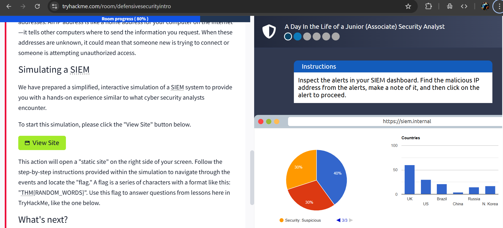
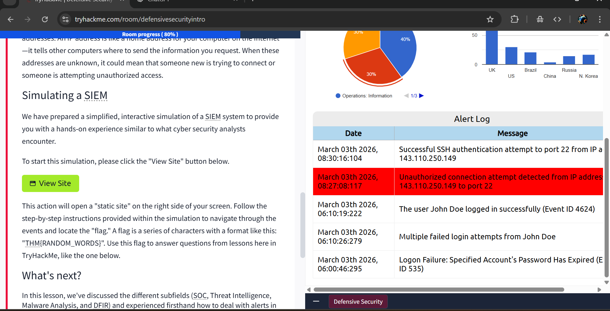
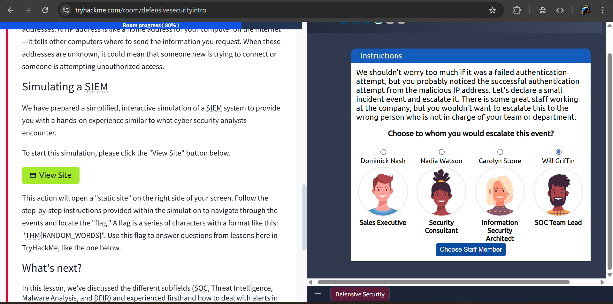
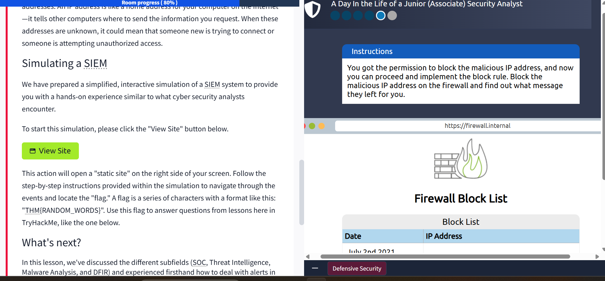

# Practical Example of Defensive Security - 2026-02-03

## Objective
- Know what SIEM is and have hands-on experience similar to that of a junior cybersecurity analyst.

## What I Learned
- SIEM stands for Security Information and Event Management
- A flag is a piece of text to find proving that a task was completed, or an exploit was completed 
- Identified a malicious IP address, scanned it to prove if it's really malicious, learned who to escalate the event to, and blocked it with a firewall blocker

## Challenges
- I found it a bit difficult at first to find the IP address that was malicious during the practicals

## Tools / Commands
- A stimulated SIEM tool provided by TryHackMe

## Real-World Relevance
- Helps monitor logs and get alerts on malicious IPs

## Screenshots

## Next Steps
- Careers in Cyber
